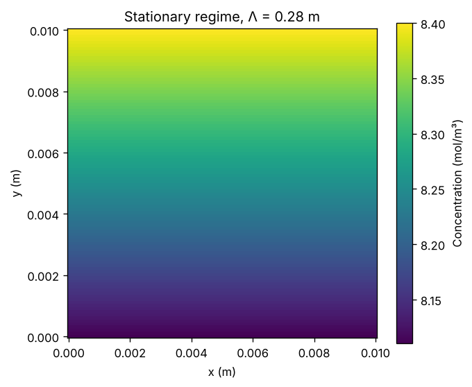
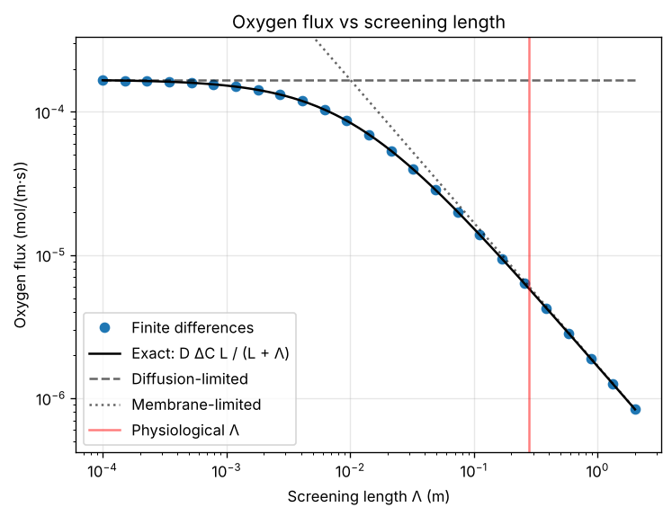
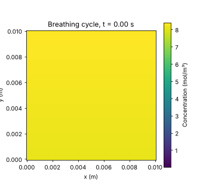
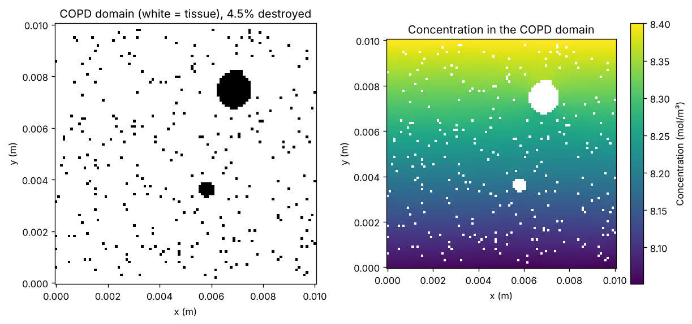

# Oxygen Diffusion in Pulmonary Acinus
*Computational Modeling and Analysis*

---
## Research Team
- Aya KAMOUNI
- Kpankpan Edouard KAMBIRE
- H'nia HARRAS
- Anas SABBAHI

**Supervisor:** Marcel Filoche

---
## Introduction
- Pulmonary acinus: functional gas exchange unit
- Oxygen transport occurs via diffusion
- Complex 3D structure simplified to 2D model
- Clinical relevance: COPD, emphysema

---
## Problem Statement
**How does oxygen diffuse through acinar structure?**

Objectives:
1. Model stationary diffusion
2. Simulate breathing dynamics
3. Analyze pathological conditions (COPD)
4. Quantify screening effects

---
## Mathematical Framework

### Diffusion Equation
$$
\frac{\partial C}{\partial t} = D \nabla^2 C
$$

### Stationary Case
$$
\nabla^2 C = 0
$$

### Boundary Conditions
With $u = C - C_b$:
- **Dirichlet:** $u = C_a - C_b$ (alveolar air)
- **Robin:** $\partial u / \partial n = -u / \Lambda$, $\Lambda = D/W$ (membrane, capillaries)
- **Neumann:** $\partial u / \partial n = 0$ (sides)

---
## Numerical Implementation

### Finite Difference Method
$$
\frac{C_{i+1,j} + C_{i-1,j} + C_{i,j+1} + C_{i,j-1} - 4C_{i,j}}{h^2} = 0
$$

### Linear System
$$
A\mathbf{C} = \mathbf{b}
$$

- Sparse matrix formulation
- Direct sparse solver (SciPy)
- Validated against the exact solution (error < 10⁻¹²)

---
## Stationary Regime Results

### Concentration Field

**Key observations:**
- Linear concentration profile (exact solution)
- Maximum at alveolar surface
- Small drop across the domain when Λ ≫ L
- Flux $\Phi = D (C_a - C_b) L / (L + \Lambda)$

---
## Screening Effect Analysis

### Oxygen Flux vs Screening Length

**Findings:**
- Flux decreases monotonically with Λ
- Λ ≪ L: diffusion-limited, flux → D ΔC (screening)
- Λ ≫ L: membrane-limited, flux ∝ 1/Λ
- Physiological Λ ≈ 0.28 m: membrane-limited at the 1 cm scale

---
## Quasi-Stationary Regime

### Breathing Dynamics
Boundary condition:
$$
u(x, y=L) = C_a - C_b + C_1(\cos\omega t - 1)
$$

### Time-Dependent Results

**Features:**
- Periodic concentration variations
- Flux oscillates in phase with breathing
- Cycle-averaged flux independent of breathing rate
- Valid when $L^2/D$ ≪ breathing period

---
## COPD Pathology Modeling

### Domain Deformation

### Pathological Effects
- Destroyed tissue: impermeable obstacles to diffusion
- Membrane thickening: lower permeability, larger Λ
- Destruction alone: < 1% flux reduction at physiological Λ, 9-14% when Λ ≲ L

**Flux reduction:** ≈ 50% when membrane permeability is halved

---
## Key Findings

1. **Solver validated** against the exact solution
2. **Screening phenomenon**: diffusion- vs membrane-limited regimes
3. **Breathing dynamics** modeled in the quasi-stationary approximation
4. **COPD pathology**: membrane damage dominates in the membrane-limited regime

---
## Clinical Implications

### Potential Applications
- Quantify gas exchange impairment
- Understand which structural changes matter most
- Basis for patient-specific models

*Qualitative results, not validated against clinical data.*

---
## Limitations and Future Work

### Current Limitations
- 2D geometry simplification
- Homogeneous tissue assumption
- Constant diffusion coefficient
- Quasi-stationary approximation

### Future Directions
- 3D anatomical reconstruction
- Patient-specific modeling
- Coupled perfusion-diffusion models
- Clinical validation studies

---
## Conclusion

- Developed and validated a finite-difference diffusion model
- Simulated normal and pathological conditions
- Provided quantitative insights into the screening effect
- Established a framework for more realistic geometries

**The model bridges computational methods and respiratory physiology.**

---
## Acknowledgments

- Marcel Filoche for supervision
- Research collaborators
- Institutional support

---
## References

1. Sapoval, Filoche & Weibel (2002) *PNAS* 99:10411
2. Felici, Filoche & Sapoval (2003) *J Appl Physiol* 94:2010
3. Weibel (1984) *Pathway for Oxygen*
